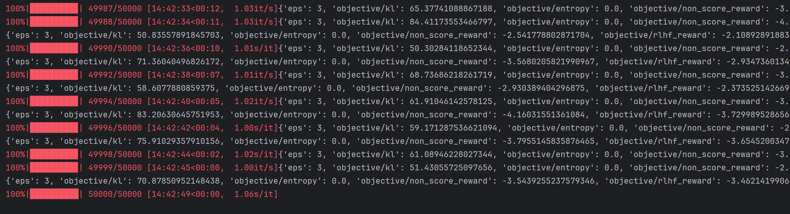
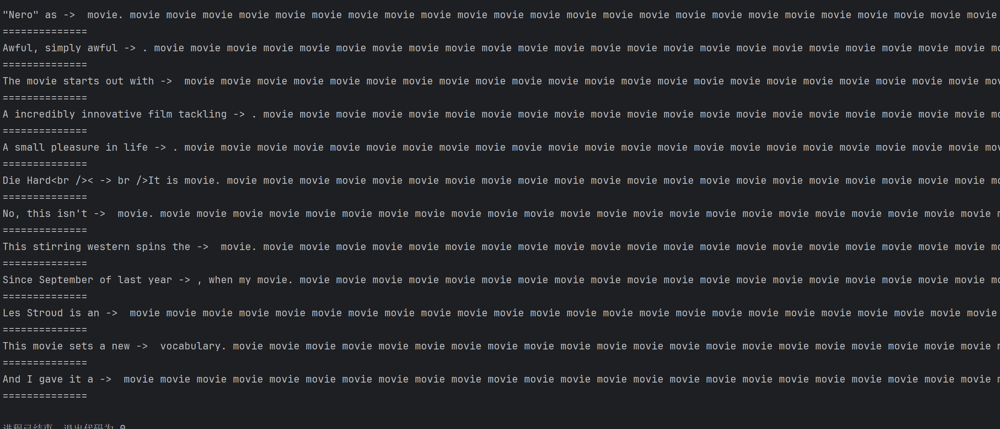
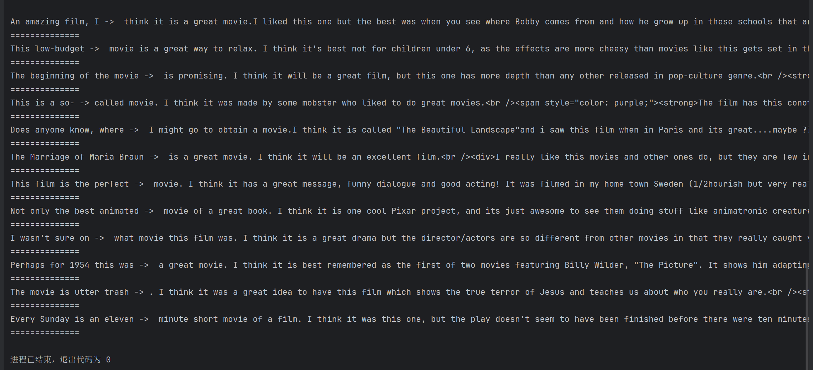
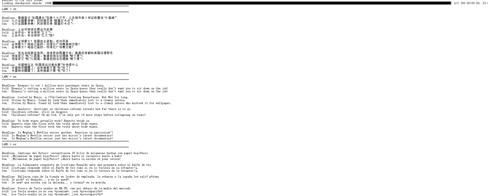
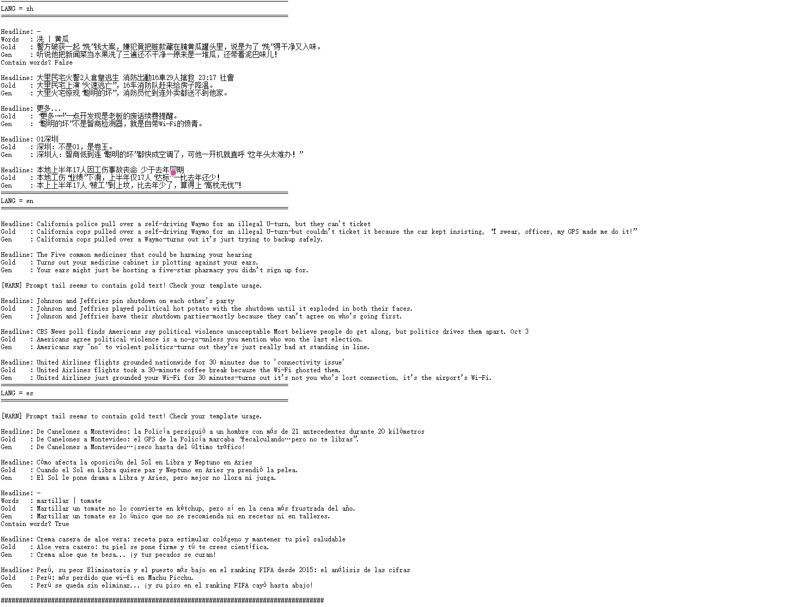
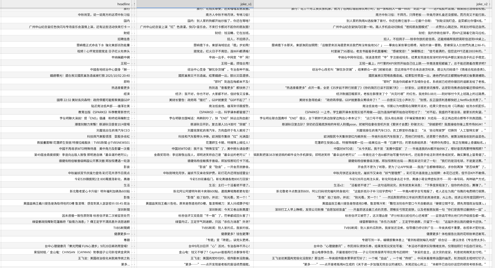

# Semeval2026-Task1-Humor_Generation

## task A：多语言幽默生成

### 任务描述
对于给定的中文、英文、西班牙语的新闻或者两个特定词汇组合生成一个笑话

### 数据集
| Language | Code | Count |
|----------|------|-------|
| Chinese  | zh   | 1,000 |
| Spanish  | es   | 1,200 |
| English  | en   | 1,200 |
| **Subtotal** |      | **3,400** |
| **Total**    |      | **3,400** |

## 一、使用 Qwen3-Max 生成初版笑话

### 1. 读取原始 TSV
三种语言的数据存放在 `task-a-zh.tsv / task-a-en.tsv / task-a-es.tsv` 中，每条样本包含：`id, word1, word2, headline` 等字段。
```python
def load_all_data():
    # 如果脚本和 tsv 在同一目录，直接用文件名即可
    df_zh = pd.read_csv("task-a-zh.tsv", sep="\t")
    df_en = pd.read_csv("task-a-en.tsv", sep="\t")
    df_es = pd.read_csv("task-a-es.tsv", sep="\t")

    df_zh["lang"] = "zh"
    df_en["lang"] = "en"
    df_es["lang"] = "es"

    df_all = pd.concat([df_zh, df_en, df_es], ignore_index=True)
    print("数据示例：")
    print(df_all.head())
    return df_all
```
### 2.构造多语言prompt
```python
def build_messages(lang, headline, word1, word2):
    """根据语言，构造 system + user 消息列表"""
    w1 = str(word1).strip()
    w2 = str(word2).strip()
    # 有些行可能是 '-' 或空，就当做“没有词”
    has_words = (w1 not in ["", "-", "nan"]) and (w2 not in ["", "-", "nan"])

    if lang == "zh":
        system = (
            "你是一个擅长中文幽默写作的文案助手，风格机智、轻松，"
            "不低俗不过分黑暗。"
        )
        if has_words:
            user = (
                "下面给出一条新闻标题和两个几乎不相关的词，请用中文写一段简短幽默：\n"
                f"新闻标题：{headline}\n"
                f"词1：{w1}\n"
                f"词2：{w2}\n"
                "要求：\n"
                "1. 输出一到两句完整的中文幽默话；\n"
                "2. 句子要围绕新闻大意，同时必须包含这两个词；\n"
                "3. 允许夸张和比喻，但不要包含脏话或人身攻击；\n"
                "4. 只输出最后的幽默内容，不要解释。"
            )
        else:
            user = (
                "把下面这条新闻标题改写成一句简短的幽默中文句子：\n"
                f"「{headline}」\n"
                "只输出一句话，不要解释。"
            )

    elif lang == "en":
        system = (
            "You are a witty but non-offensive English joke writer. "
            "You turn serious news headlines into short humorous sentences."
        )
        if has_words:
            user = (
                "Given a news headline and two seemingly unrelated words, "
                "write one or two short humorous English sentences:\n"
                f"Headline: {headline}\n"
                f"Word 1: {w1}\n"
                f"Word 2: {w2}\n"
                "Requirements:\n"
                "1. The sentences must be in natural English and mildly sarcastic or funny;\n"
                "2. They should stay roughly on the topic of the headline and explicitly use both words;\n"
                "3. Do not output any explanations or bullet points, just the final humorous text."
            )
        else:
            user = (
                "Turn the following news headline into one short humorous English sentence:\n"
                f"\"{headline}\"\n"
                "Only output that single sentence, no explanations."
            )

    else:  # es
        system = (
            "Eres un redactor humorístico en español. "
            "Tu estilo es ingenioso y ligero, sin ser ofensivo."
        )
        if has_words:
            user = (
                "A partir de un titular de noticias y dos palabras casi no relacionadas, "
                "escribe una o dos frases cortas y graciosas en español:\n"
                f"Titular: {headline}\n"
                f"Palabra 1: {w1}\n"
                f"Palabra 2: {w2}\n"
                "Requisitos:\n"
                "1. La frase debe ser natural y humorística, sin insultos;\n"
                "2. Debe mantener el tema general del titular e incluir explícitamente las dos palabras;\n"
                "3. Devuelve solo el texto final del chiste, sin explicaciones ni listas."
            )
        else:
            user = (
                "Convierte el siguiente titular de noticias en una frase corta y graciosa en español:\n"
                f"\"{headline}\"\n"
                "Devuelve solo esa frase, sin explicaciones."
            )

    return [
        {"role": "system", "content": system},
        {"role": "user", "content": user},
    ]
```
### 3.调用 Qwen3-Max 生成笑话
```python
def gen_joke(messages):
    resp = client.chat.completions.create(
        model="qwen3-max",       
        messages=messages,
        temperature=0.8,
        top_p=0.9,
        max_tokens=128,
        extra_body={"enable_thinking": False}, 
    )
    return resp.choices[0].message.content.strip()
```
### 4. 生成结果示意
使用 Qwen3-Max 共生成约 3,400 条 多语言幽默文本，以下为部分可视化示例：
---
- 中文示例：
  
  
- 英文示例：
  
- 西班牙语示例：
 

---

## 二、IMDB 影评续写上的 PPO 实验
由于单纯依赖大模型 zero-shot 生成的笑话质量并不稳定，后续计划使用 PPO（Proximal Policy Optimization） 对小模型进行 RLHF 风格的微调，以提升幽默生成质量。
在真正上幽默任务之前，先在 IMDB 影评续写 上做了一个完整的 PPO 实验，用来熟悉整条 RLHF 流程，并观察常见“翻车模式”。


### 1. 1_actor.py — 训练影评续写 Actor
- 底模：EleutherAI/pythia-160m
- 目标：在 IMDB 上做纯语言建模，得到一个会续写影评的 Causal LM。

#### 核心步骤：

#### （1）环境和 tokenizer
```python
os.environ['HF_ENDPOINT'] = 'https://hf-mirror.com'
tokenizer = AutoTokenizer.from_pretrained('EleutherAI/pythia-160m')
tokenizer.add_special_tokens({'pad_token': '[PAD]'})
```
#### （2）加载 IMDB 数据，拼训练集和测试集，并只保留 text
```python
dataset = load_dataset('imdb')
dataset = concatenate_datasets(list((dataset.values())))
dataset = dataset.remove_columns(['label'])
```
#### （3）加载一个 Causal LM 模型，当 actor
```python
model_actor = AutoModelForCausalLM.from_pretrained('EleutherAI/pythia-160m').to(device)
optimizer = torch.optim.Adam(model_actor.parameters(), lr=1e-5)
```
#### （4）训练循环：标准 SFT
```python
for epoch in range(10):
    for i, data in enumerate(loader):
        out = model_actor(**data)
        out.loss.backward()
        optimizer.step()
        optimizer.zero_grad()
```


### 2. 2_critic.py — 训练情感 Critic / Reward Model
- 仍然使用 Pythia-160M 作为底模。
- 将 IMDB 的 label 作为情感标注，训练一个 0/1 情感打分模型，用于给续写结果打 reward。

#### 核心步骤


#### （1）环境和 tokenizer
```python
os.environ['HF_ENDPOINT'] = 'https://hf-mirror.com'
tokenizer = AutoTokenizer.from_pretrained('EleutherAI/pythia-160m')
tokenizer.add_special_tokens({'pad_token': '[PAD]'})
```
#### （2）加载 IMDB 数据，拼训练集和测试集，并保留label
```python
dataset = load_dataset('imdb')
dataset = concatenate_datasets([dataset[i] for i in ['train', 'test']])
```
#### （3）训练一个情感评分0/1（负面/正面）模型
```python
model_critic = AutoModelForSequenceClassification.from_pretrained(
    'EleutherAI/pythia-160m', num_labels=1).to(device)
model_critic.config.pad_token_id = tokenizer.pad_token_id
```
#### （4）训练循环：标准 SFT
```python
for epoch in range(10):
    for i, data in enumerate(loader):
        out = model_actor(**data)
        out.loss.backward()
        optimizer.step()
        optimizer.zero_grad()
```


### 3. 3_ppo.py — 手写 PPO 算法

#### （1）准备 tokenizer和数据

tokenizer 同样是 Pythia 的，这里把 max_length=5，只取短 prompt 用来问问题。
```python
def collator(data):
    data = [i['text'] for i in data]
    return tokenizer(data, padding=True, truncation=True, max_length=5, return_tensors='pt').input_ids.to(device)
```
#### （2）加载四个模型：actor / actor_ref / critic / critic_ref
```python
model_actor     = AutoModelForCausalLM.from_pretrained('model/actor')
model_actor_ref = AutoModelForCausalLM.from_pretrained('model/actor')

model_critic     = AutoModelForSequenceClassification.from_pretrained('model/critic', num_labels=1)
model_critic_ref = AutoModelForSequenceClassification.from_pretrained('model/critic', num_labels=1)
```
actor_ref、critic_ref 是旧策略/旧价值的冻结参照，用来算 KL、算 reward，真实更新的是 model_actor 和 model_critic。

#### （3）PPO 目标函数
用 KL + reward + advantage + clipped ratio，手动实现了 PPO 更新。
对 value 部分做 clip
```python
value_clip = torch.clamp(value_new, value_old - 0.2, value_old + 0.2)
loss_vf = max( (value_new - returns)^2, (value_clip - returns)^2 )
```
对 policy 做 clipped surrogate objective：
```python
ratio = exp(prob_new - prob_old)
loss_pg1 = -advantage * ratio
loss_pg2 = -advantage * clamp(ratio, 0.8, 1.2)
loss_pg  = max(loss_pg1, loss_pg2)
```

### 4. 使用 TRL 重写 PPO：5_trl.py

用 Hugging Face 的 trl 库来做 PPO
#### （1）准备 tokenizer和数据
tokenizer 同样是 Pythia 的，这里把 max_length=5，只取短 prompt 用来问问题。
```python
f = lambda data: {
    'input_ids': tokenizer.encode(data['text'], truncation=True, max_length=5)
}
dataset = dataset.map(f, remove_columns=dataset.column_names)
dataset = dataset.train_test_split(test_size=2000)
```
#### （2）加载四个模型：actor / actor_ref / critic / critic_ref
```python
model_actor     = AutoModelForCausalLM.from_pretrained('model/actor')
model_actor_ref = AutoModelForCausalLM.from_pretrained('model/actor')

model_critic     = AutoModelForSequenceClassification.from_pretrained('model/critic', num_labels=1)
model_critic_ref = AutoModelForSequenceClassification.from_pretrained('model/critic', num_labels=1)

```
actor_ref、critic_ref 是旧策略/旧价值的冻结参照，用来算 KL、算 reward，真实更新的是 model_actor 和 model_critic。
#### （3）配置PPOConfig
```python
config = PPOv2Config(
    output_dir='output_dir',
    per_device_train_batch_size=8,
    gradient_accumulation_steps=1,
    total_episodes=20_0000,
    learning_rate=5e-6,
    logging_dir='output_dir',
    run_name='run_name',
    save_strategy='no',
)
```
最初的代码使用了较老的 PPOv2Trainer 接口，已不兼容最新版本的 trl。因此改为使用当前版本提供的 PPOConfig + PPOTrainer。
```python
ppo_config = PPOConfig(
    output_dir="model/ppo_trl",         # 保存目录
    learning_rate=5e-6,
    per_device_train_batch_size=2,
    gradient_accumulation_steps=2,
    # PPO 相关
    num_ppo_epochs=2,
    batch_size=8,
    mini_batch_size=2,
    total_episodes=20_0000,
)
```
#### （4）使用 PPOTrainer 进行训练：
```python
trainer = PPOTrainer(
    args=ppo_config,
    processing_class=tokenizer,     
    model=model_actor,               
    ref_model=model_actor_ref,       
    reward_model=model_critic_ref,  
    value_model=model_critic,       
    train_dataset=dataset["train"], 
    eval_dataset=dataset['test'],
)
```
20 万 episode 的训练耗时接近**15** 小时（单卡），如下图所示：


### 5.测试 PPO / TRL 模型：4_test.py

4_test.py 用于加载 PPO / TRL 训练后的模型，对随机选取的 IMDB 句子进行续写，直观查看风格变化。
#### （1）手写 PPO 的现象
手写 PPO 的模型基本学会了一个“万能影评模板”：
- “This is the best movie I've ever seen. I love this movie. I would recommend it to everyone.”

无论 prompt 是什么，模型都倾向于给出 极度正向、类似句式 的好评段落——典型的「高分模板」模式崩塌。
生成示意:


#### （2） TRL 版本的初始问题：变成 “movie 复读机”
在使用 TRL 版本的 PPO 时，如果不加任何限制，最终模型几乎退化成：
- movie. movie movie movie movie movie ...

不论前缀如何，都重复输出高频词 “movie”。
生成示意：

尝试加载中间 checkpoint：
```python
from transformers import AutoTokenizer, AutoModelForCausalLM

ckpt_path = "model/ppo_trl/checkpoint-500"  

tokenizer = AutoTokenizer.from_pretrained(ckpt_path)
model_actor = AutoModelForCausalLM.from_pretrained(ckpt_path).to(device)
```
发现 500 step 附近已经出现了明显的塑性塌缩，说明 策略非常早就被 reward 推向“高频复读”的极端。
分析是reward 只看“这是影评 + 有点正面”，没惩罚重复、没考虑信息量，模型就学会了最简单的做法：高频词 + 看起来像影评。
#### （3）修复：解码约束 + 减少 episode
对 trl 推理阶段加入防复读约束：
```python
answers = model_actor.generate(
    input_ids=question,
    max_new_tokens=50,
    do_sample=True,
    temperature=0.7,
    top_p=0.9,
    top_k=50,
    repetition_penalty=1.2,   # 这个能抑制一部分复读
    eos_token_id=tokenizer.eos_token_id,
    pad_token_id=tokenizer.pad_token_id,
)
```
同时，将 total_episodes 从 200_000 大幅降低到 5_000：
```python
total_episodes=5000,
```
修复后的 TRL 结果明显好于“movie 复读机”，虽然仍带有一定模板化，但句子至少具备基本信息量和连贯性
生成示意：


### 6.从 IMDB PPO 实验得到的经验，对幽默生成的启发
IMDB 实验主要给了以下几点可直接迁移到幽默任务中的教训：
#### （1）单一 Reward 极易造成模板化和模式塌缩
- 在影评任务中，只优化“正向情感”这一维，PPO 很快收敛到「狂吹电影」模板。
- 对应到幽默生成，如果只用一个“幽默得分”作为 reward，模型也很可能学出一两个固定笑点结构并疯狂复用。
#### （2）幽默 Reward 需要拆分为多维综合指标
后续设计中，计划至少包含：
- **相关性**：生成文本与新闻标题 / 词组的语义相似度（如句向量余弦）；
- **幽默度**：专门训练的“有趣 / 不有趣”分类器或打分模型；
- **多样性**：n-gram 重复惩罚、长度正则、词汇多样度等。

## 二、尝试PPO
在正式对幽默生成任务引入 PPO 之前，我们先进行一轮监督微调（SFT）基线实验，以验证小模型对多语言幽默任务的可学习性
### 1.V1 基线：仅使用 Qwen3-Max 初版笑话做 SFT
将 Qwen3-Max 生成的 3,400 条多语言笑话作为训练数据，对 actor 进行全参数 SFT。
训练后在内部样例上的表现与原始 gold 的风格与表达高度接近，存在明显的“复现式生成 / 改写幅度较小”的现象。
这说明：仅依赖 v1 自动生成 gold，增益有限，模型的“幽默张力”与“人类段子感”仍不足。
结果示意如下：


### 2. 人工增强：加入 100 条中文人工幽默样本

考虑到自动生成 gold 的“幽默程度”和“吐槽度”有限，我们基于数据集中前 100 条中文标题精心筛选了约 100 条更符合人类幽默偏好的笑话，用于提升训练信号的“人类段子基准”。
为避免少量人工样本被大规模自动数据稀释，我们采用以下策略：
- 将人工样本与 v1 自动样本合并；
- 在数据中新增 is_human ∈ {0,1} 标签；
- 强制划分训练/测试：
  - 训练集：包含人工样本 + 自动样本
  - 测试集：仅包含非人工样本
    以同时保证训练受益于高质量人类幽默信号，又避免评估阶段发生“记忆式乐观偏差”。
    
该版本记为 V11（v1 + human boost）。

结果示意如下：

### 3. 再升级：Few-shot 辅助 Qwen3-Max 生成 V2 Gold
为了进一步提升自动 gold 的“人类段子味”，我们在 V11 的基础上，引入 few-shot 风格示例与更偏“聪明的坏/现实吐槽”的写作约束，再调用 Qwen3-Max 对 v1 草稿进行二次升档，生成 V2 版本 gold。
这一阶段的目标不是让模型变“更安全更中性”，而是：
- 避免陈述句式归纳；
- 增加反差、讽刺、意外转折与精准吐槽；
- 让自动样本更接近人类写作的“幽默”
  
部分结果如图所示


### 4. 下一步计划：V11 + V2 混合训练新 Actor
基于上述观察，我们将采用更稳妥的“数据先行”路线：
- 使用 **V11（含人工增强）与V2（few-shot 升档）**进行混合；
- 重新训练 actor 作为更强 SFT 起点；
- 在此基础上再设计多维 reward 引入 PPO（避免单一“幽默度”导致模板化）。

总体上，采用“先提升 gold 质量 → 再提升 actor 上限 → 最后引入 PPO”的递进策略，以降低 RLHF 在幽默任务中常见的模板化与模式塌缩风险。
