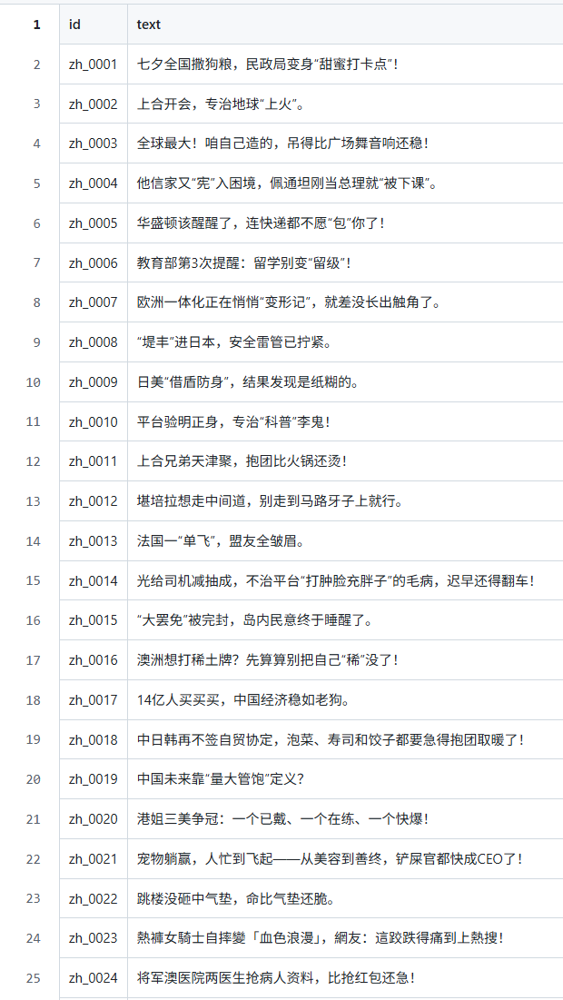
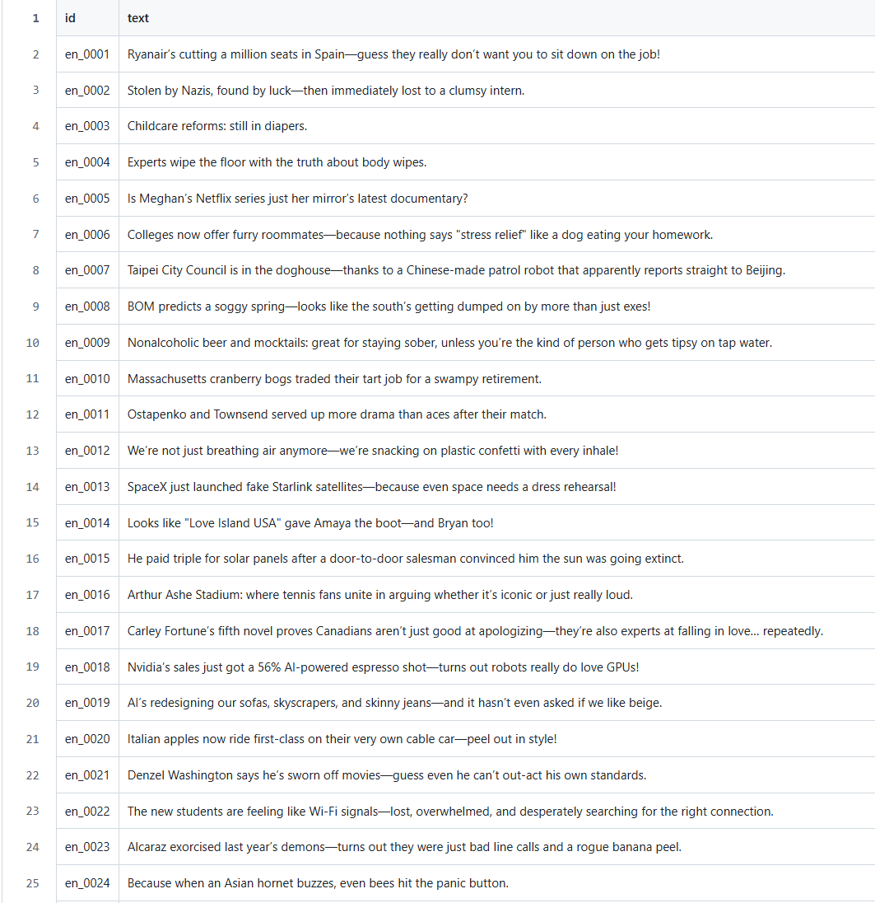
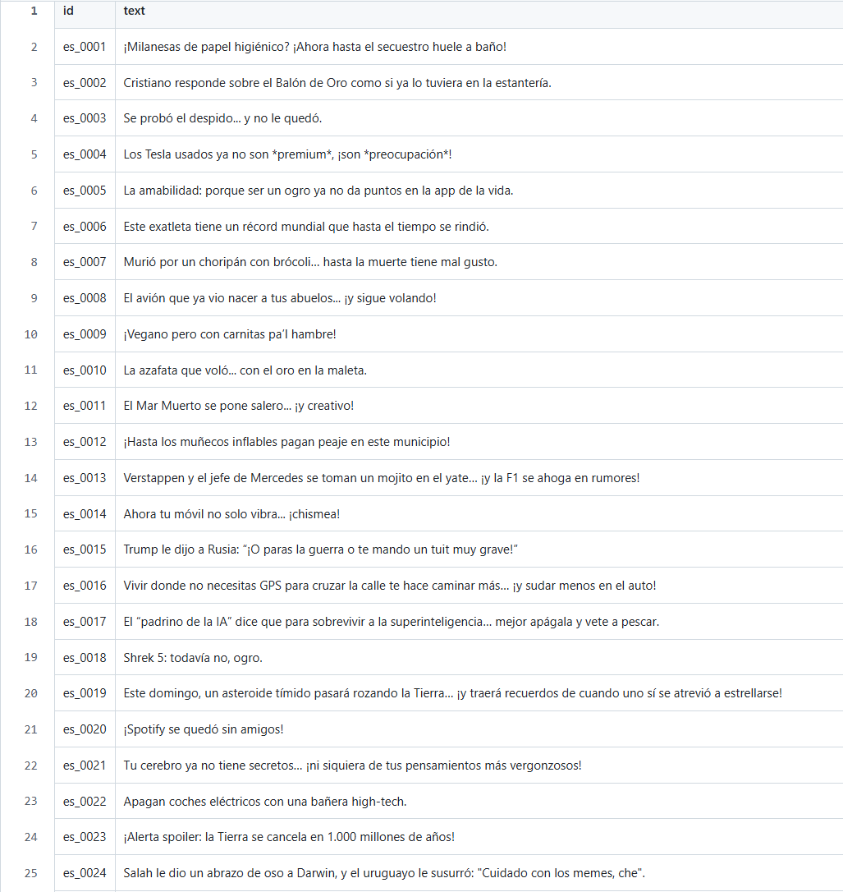

# Semeval2026-Task1-Humor_Generation

## task A 

### 任务描述
对于给定的中文、英文、西班牙语的新闻或者两个特定词汇组合生成一个笑话

### 数据集
| Language | Code | Count |
|----------|------|-------|
| Chinese  | zh   | 1,000 |
| Spanish  | es   | 1,200 |
| English  | en   | 1,200 |
| **Subtotal** |      | **3,400** |
| **Total**    |      | **3,400** |

### 尝试调用大模型api来生成初版笑话
调用qwen3-max生成初版笑话


**读取原始 TSV 文件**
```python
def load_all_data():
    # 如果脚本和 tsv 在同一目录，直接用文件名即可
    df_zh = pd.read_csv("task-a-zh.tsv", sep="\t")
    df_en = pd.read_csv("task-a-en.tsv", sep="\t")
    df_es = pd.read_csv("task-a-es.tsv", sep="\t")

    df_zh["lang"] = "zh"
    df_en["lang"] = "en"
    df_es["lang"] = "es"

    df_all = pd.concat([df_zh, df_en, df_es], ignore_index=True)
    print("数据示例：")
    print(df_all.head())
    return df_all
```
**构造多语言prompt**
```python
def build_messages(lang, headline, word1, word2):
    """根据语言，构造 system + user 消息列表"""
    w1 = str(word1).strip()
    w2 = str(word2).strip()
    # 有些行可能是 '-' 或空，就当做“没有词”
    has_words = (w1 not in ["", "-", "nan"]) and (w2 not in ["", "-", "nan"])

    if lang == "zh":
        system = (
            "你是一个擅长中文幽默写作的文案助手，风格机智、轻松，"
            "不低俗不过分黑暗。"
        )
        if has_words:
            user = (
                "下面给出一条新闻标题和两个几乎不相关的词，请用中文写一段简短幽默：\n"
                f"新闻标题：{headline}\n"
                f"词1：{w1}\n"
                f"词2：{w2}\n"
                "要求：\n"
                "1. 输出一到两句完整的中文幽默话；\n"
                "2. 句子要围绕新闻大意，同时必须包含这两个词；\n"
                "3. 允许夸张和比喻，但不要包含脏话或人身攻击；\n"
                "4. 只输出最后的幽默内容，不要解释。"
            )
        else:
            user = (
                "把下面这条新闻标题改写成一句简短的幽默中文句子：\n"
                f"「{headline}」\n"
                "只输出一句话，不要解释。"
            )

    elif lang == "en":
        system = (
            "You are a witty but non-offensive English joke writer. "
            "You turn serious news headlines into short humorous sentences."
        )
        if has_words:
            user = (
                "Given a news headline and two seemingly unrelated words, "
                "write one or two short humorous English sentences:\n"
                f"Headline: {headline}\n"
                f"Word 1: {w1}\n"
                f"Word 2: {w2}\n"
                "Requirements:\n"
                "1. The sentences must be in natural English and mildly sarcastic or funny;\n"
                "2. They should stay roughly on the topic of the headline and explicitly use both words;\n"
                "3. Do not output any explanations or bullet points, just the final humorous text."
            )
        else:
            user = (
                "Turn the following news headline into one short humorous English sentence:\n"
                f"\"{headline}\"\n"
                "Only output that single sentence, no explanations."
            )

    else:  # es
        system = (
            "Eres un redactor humorístico en español. "
            "Tu estilo es ingenioso y ligero, sin ser ofensivo."
        )
        if has_words:
            user = (
                "A partir de un titular de noticias y dos palabras casi no relacionadas, "
                "escribe una o dos frases cortas y graciosas en español:\n"
                f"Titular: {headline}\n"
                f"Palabra 1: {w1}\n"
                f"Palabra 2: {w2}\n"
                "Requisitos:\n"
                "1. La frase debe ser natural y humorística, sin insultos;\n"
                "2. Debe mantener el tema general del titular e incluir explícitamente las dos palabras;\n"
                "3. Devuelve solo el texto final del chiste, sin explicaciones ni listas."
            )
        else:
            user = (
                "Convierte el siguiente titular de noticias en una frase corta y graciosa en español:\n"
                f"\"{headline}\"\n"
                "Devuelve solo esa frase, sin explicaciones."
            )

    return [
        {"role": "system", "content": system},
        {"role": "user", "content": user},
    ]
```
**生成幽默**
```python
def gen_joke(messages):
    resp = client.chat.completions.create(
        model="qwen3-max",       
        messages=messages,
        temperature=0.8,
        top_p=0.9,
        max_tokens=128,
        extra_body={"enable_thinking": False}, 
    )
    return resp.choices[0].message.content.strip()
```
### 结果
使用qwen3-max生成的3400条部分结果如下：



### PPO
由于大模型zero-shot的生成的笑话效果并不好，考虑使用PPO提升大模型生成笑话的能力，以imdb影评续写为例，描述PPO具体过程。


**1_actor.py**


拿 Pythia-160M 当底座，在 IMDB 影评上做纯语言建模，得到一个会续写影评的语言模型 actor。


**具体步骤**


1.环境和 tokenizer
```python
os.environ['HF_ENDPOINT'] = 'https://hf-mirror.com'
tokenizer = AutoTokenizer.from_pretrained('EleutherAI/pythia-160m')
tokenizer.add_special_tokens({'pad_token': '[PAD]'})
```
2.加载 IMDB 数据，拼训练集和测试集，并只保留 text
```python
dataset = load_dataset('imdb')
dataset = concatenate_datasets(list((dataset.values())))
dataset = dataset.remove_columns(['label'])
```
3.加载一个 Causal LM 模型，当 actor
```python
model_actor = AutoModelForCausalLM.from_pretrained('EleutherAI/pythia-160m').to(device)
optimizer = torch.optim.Adam(model_actor.parameters(), lr=1e-5)
```
4.训练循环：标准 SFT
```python
for epoch in range(10):
    for i, data in enumerate(loader):
        out = model_actor(**data)
        out.loss.backward()
        optimizer.step()
        optimizer.zero_grad()
```


**2_critic.py**


用同一个 Pythia-160M 底座，训练一个“给影评打好/坏分”的分类模型，当成 critic / reward model。

**具体步骤**


1.环境和 tokenizer
```python
os.environ['HF_ENDPOINT'] = 'https://hf-mirror.com'
tokenizer = AutoTokenizer.from_pretrained('EleutherAI/pythia-160m')
tokenizer.add_special_tokens({'pad_token': '[PAD]'})
```
2.加载 IMDB 数据，拼训练集和测试集，并保留label
```python
dataset = load_dataset('imdb')
dataset = concatenate_datasets([dataset[i] for i in ['train', 'test']])
```
3.训练一个情感评分0/1（负面/正面）模型
```python
model_critic = AutoModelForSequenceClassification.from_pretrained(
    'EleutherAI/pythia-160m', num_labels=1).to(device)
model_critic.config.pad_token_id = tokenizer.pad_token_id
```
4.训练循环：标准 SFT
```python
for epoch in range(10):
    for i, data in enumerate(loader):
        out = model_actor(**data)
        out.loss.backward()
        optimizer.step()
        optimizer.zero_grad()
```


**3_ppo.py**

1.准备 tokenizer和数据
tokenizer 同样是 Pythia 的，这里把 max_length=5，只取短 prompt 用来问问题。
```python
def collator(data):
    data = [i['text'] for i in data]
    return tokenizer(data, padding=True, truncation=True, max_length=5, return_tensors='pt').input_ids.to(device)
```
2.加载四个模型：actor / actor_ref / critic / critic_ref
```python
model_actor     = AutoModelForCausalLM.from_pretrained('model/actor')
model_actor_ref = AutoModelForCausalLM.from_pretrained('model/actor')

model_critic     = AutoModelForSequenceClassification.from_pretrained('model/critic', num_labels=1)
model_critic_ref = AutoModelForSequenceClassification.from_pretrained('model/critic', num_labels=1)
```
actor_ref、critic_ref 是旧策略/旧价值的冻结参照，用来算 KL、算 reward，真实更新的是 model_actor 和 model_critic。

3. PPO 更新
用 KL + reward + advantage + clipped ratio，手动实现了 PPO 更新。
对 value 部分做 clip
```python
value_clip = torch.clamp(value_new, value_old - 0.2, value_old + 0.2)
loss_vf = max( (value_new - returns)^2, (value_clip - returns)^2 )
```
对 policy 做 clipped surrogate objective：
```python
ratio = exp(prob_new - prob_old)
loss_pg1 = -advantage * ratio
loss_pg2 = -advantage * clamp(ratio, 0.8, 1.2)
loss_pg  = max(loss_pg1, loss_pg2)
```

**5_trl.py**
用 Hugging Face 的 trl 库来做 PPO
1.准备 tokenizer和数据
tokenizer 同样是 Pythia 的，这里把 max_length=5，只取短 prompt 用来问问题。
```python
f = lambda data: {
    'input_ids': tokenizer.encode(data['text'], truncation=True, max_length=5)
}
dataset = dataset.map(f, remove_columns=dataset.column_names)
dataset = dataset.train_test_split(test_size=2000)
```
2.加载四个模型：actor / actor_ref / critic / critic_ref
```python
model_actor     = AutoModelForCausalLM.from_pretrained('model/actor')
model_actor_ref = AutoModelForCausalLM.from_pretrained('model/actor')

model_critic     = AutoModelForSequenceClassification.from_pretrained('model/critic', num_labels=1)
model_critic_ref = AutoModelForSequenceClassification.from_pretrained('model/critic', num_labels=1)

```
actor_ref、critic_ref 是旧策略/旧价值的冻结参照，用来算 KL、算 reward，真实更新的是 model_actor 和 model_critic。
3.配置PPOConfig
```python
config = PPOv2Config(
    output_dir='output_dir',
    per_device_train_batch_size=8,
    gradient_accumulation_steps=1,
    total_episodes=20_0000,
    learning_rate=5e-6,
    logging_dir='output_dir',
    run_name='run_name',
    save_strategy='no',
)
```
由于老的 PPOv2 API已经不适用于现在最新版本的trl，遂将代码改成如下：
```python
ppo_config = PPOConfig(
    output_dir="model/ppo_trl",         # 保存目录
    learning_rate=5e-6,
    per_device_train_batch_size=2,
    gradient_accumulation_steps=2,
    # PPO 相关
    num_ppo_epochs=2,
    batch_size=8,
    mini_batch_size=2,
    total_episodes=20_0000,
)
```
4.创建 PPOv2Trainer
```python
trainer = PPOTrainer(
    args=ppo_config,
    processing_class=tokenizer,     
    model=model_actor,               
    ref_model=model_actor_ref,       
    reward_model=model_critic_ref,  
    value_model=model_critic,       
    train_dataset=dataset["train"], 
    eval_dataset=dataset['test'],
)
```
5.结果

**4_test.py**
加载训练好的 PPO/TRL 模型，随机问几个 IMDB 句子，看模型怎么续写


